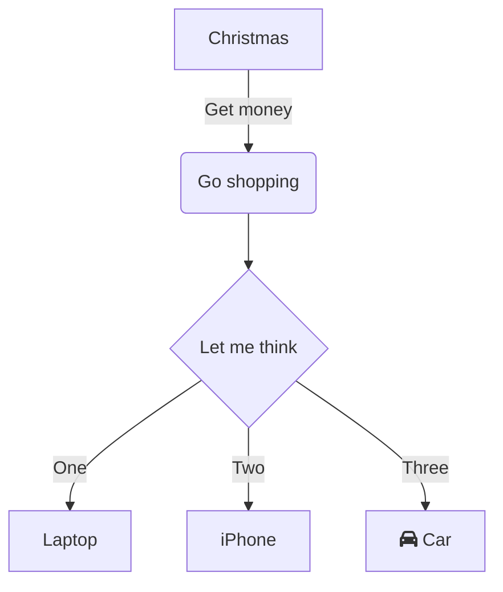

## Supported formats at a glance

| **Feature** |  | **Markdown syntax** | **Result** |
| --- | --- | --- | --- |
| **Format** | **Bold** | \*\*text\*\* + Space<br />\_\_text\_\_ + Space | **Bold** |
|  | **Italic** | \*text\* + Space<br />\_text\_ + Space | _Italic_ |
|  | **Strikethrough** | ~~text~~ + Space | ~~Strikethrough~~ |
|  | **Underline** | text + Space | Underline |
|  | **Superscript** | ^text^ + Space | ^Superscript^ |
|  | **Subscript** | ~text~ + Space | ~Subscript~ |
|  | **Text highlight** | \==text== + Space | ==Text highlight== |
|  | **Inline code** | \`text\` + Space | `Inline code` |
| **Title** | **Heading 1** | # + Space | #  Heading 1 |
|  | **Heading 2** | ## + Space | ##  Heading 2 |
|  | **Heading 3** | ### + Space | ###  Heading 3 |
|  | **Heading 4** | #### + Space | #### Heading 4 |
|  | **Heading 5** | ##### + Space | #####  Heading 5 |
|  | **Heading 6** | ###### + Space | ######  Heading 6 |
| **Code block** |  | \`\`\` + Enter<br />\`\`\`js + Enter | ```text/x-sh<br />var a = 1;<br />``` |
| **Formula** | **Inline formula** | $text$ + Space | abc$a+b$ |
|  | **Block formula** | $$text$$ + Space | abc<br />$a+b$ |
| **List** | **Numbered List** | 1. + Space<br />a. + Space | 1.   List<br />    <br />1.  List |
|  | **Bulleted List** | \* + Space<br />\- + Space | *   List<br />    <br />*   List |
|  | **Task list** | \[\] + Space<br />\[x\] + Space | *   [ ] Task list<br />    <br />*   [x] Task list |
| **Quote** |  | \> + Space | > Quote |
| **Link** |  | \[\]() + Space<br />\[abc\]() + Space<br />\[abc\](http://foo) + Space | Add web link<br />abc<br />[abc](https://foo) |
| **Image** |  | !\[\]() + Space<br />!\[\](http://foo/bar) + Space | Go to DingTalk Docs to upload the "Image" |
| **Highlight block** | **Default highlight block** | ::: + Enter | :::<br />Default style<br />::: |
|  | **Danger highlight block** | ::: danger + Enter |  |
|  | **Warning highlight block** | ::: warning + Enter |  |
|  | **Info highlight block** | ::: info + Enter |  |
|  | **Success highlight block** | ::: success + Enter |  |
|  | **Tips highlight block** | ::: tips + Enter |  |
| **Emoji** |  | :smile: + Space | 😄 |
| **Spreadsheet** |  | \|a\|b\| + Enter |  |
| **Divider** |  | \*\*\* + Enter<br />\--- + Enter | --- |
| **Text-based diagram** |  | \`\`\`mermaid + Enter | ```mermaid<br />graph TD<br />      A[Christmas] -->\|Get money\| B(Go shopping)<br />      B --> C\{Let me think\}<br />      C -->\|One\| D[Laptop]<br />      C -->\|Two\| E[iPhone]<br />      C -->\|Three\| F[fa:fa-car Car]<br />``` |

## Emoji syntax

DingTalk Docs supports entering emoji using Markdown syntax.

## Usage

Enter `:<code>:` + `Space` to convert the text into the corresponding emoji. For the full list of supported emoji, see the "Emoji code table".

## Too many codes to remember?

DingTalk Docs suggests possible emoji codes as you type, so you can use emoji without memorizing them.

## Highlight block syntax

### 1. Default style

Enter `:::` + `Enter` to insert a highlight block. Its style follows the default logic, identical to the result of inserting via the slash menu.

### 2. Warning highlight block

Enter `:::warning` + `Enter` to insert a warning highlight block, used to flag content that needs attention.

### 3. Danger highlight block

Enter `:::danger` + `Enter` to insert a danger highlight block, used to flag content that requires special attention.

### 4. Info highlight block

Enter `:::info` + `Enter` to insert an info highlight block, used to share information.

### 5. Success highlight block

Enter `:::success` + `Enter` to insert a success highlight block.

### 6. Tips highlight block

Enter `:::tips` + `Enter` to insert a tips highlight block.

## Image syntax

### Rules

Use the standard Markdown image syntax followed by Space to generate an image placeholder. The following rules apply:

*   ALT text can be empty.

*   TITLE must appear together with URL and cannot appear alone.

*   URL must use the http or https protocol.

## Text-based diagram syntax

### Format

Text-based diagrams are powered by [mermaid](https://mermaid-js.github.io/mermaid/#/) and support mermaid syntax.

```plaintext
```mermaid
or
```  mermaid
```

### Result


