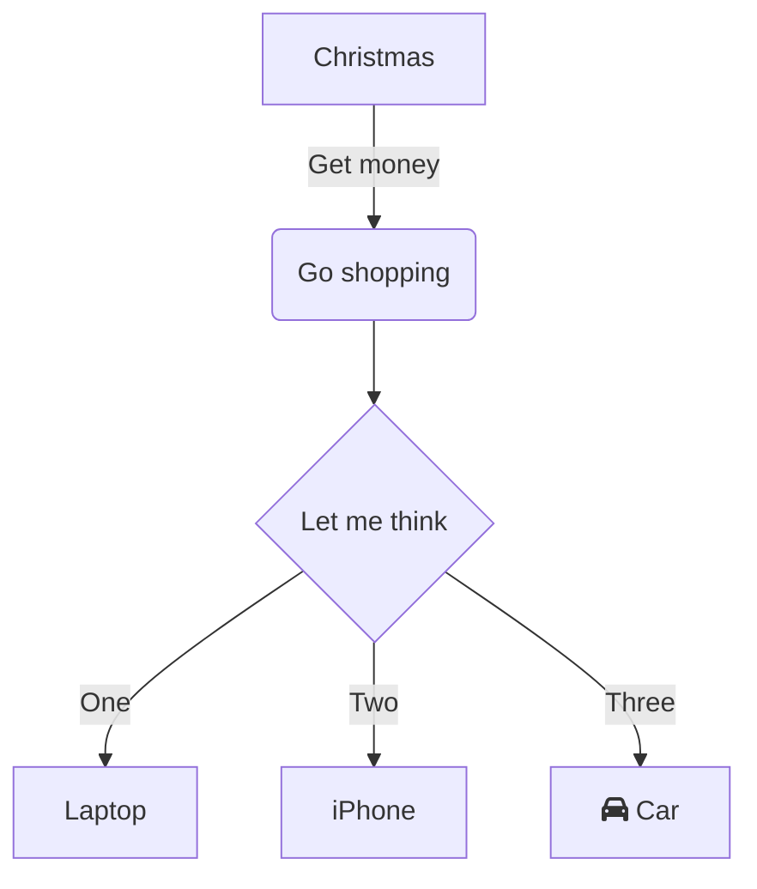

## Ringkasan format yang didukung

| **Fitur** |  | **Edit Markdown** | **Hasil** |
| --- | --- | --- | --- |
| **Format** | **Tebal** | \*\*text\*\* + Space<br />\_\_text\_\_ + Space | **Tebal** |
|  | **Miring** | \*text\* + Space<br />\_text\_ + Space | _Miring_ |
|  | **Coret** | ~~text~~ + Space | ~~Coret~~ |
|  | **Garis Bawah** | text + Space | Garis Bawah |
|  | **Superskrip** | ^text^ + Space | ^Superskrip^ |
|  | **Subskrip** | ~text~ + Space | ~Subskrip~ |
|  | **Sorot Teks** | \==text== + Space | ==Sorot Teks== |
|  | **Kode inline** | \`text\` + Space | `Kode inline` |
| **Judul** | **Judul 1** | # + Space | #  Judul 1 |
|  | **Judul 2** | ## + Space | ##  Judul 2 |
|  | **Judul 3** | ### + Space | ###  Judul 3 |
|  | **Judul 4** | #### + Space | #### Judul 4 |
|  | **Judul 5** | ##### + Space | #####  Judul 5 |
|  | **Judul 6** | ###### + Space | ######  Judul 6 |
| **Blok kode** |  | \`\`\` + Enter<br />\`\`\`js + Enter | ```text/x-sh<br />var a = 1;<br />``` |
| **Formula** | **Formula inline** | $text$ + Space | abc$a+b$ |
|  | **Formula blok** | $$text$$ + Space | abc<br />$a+b$ |
| **Daftar** | **Daftar Bernomor** | 1. + Space<br />a. + Space | 1.   Daftar<br />    <br />1.  Daftar |
|  | **Daftar Berpoin** | \* + Space<br />\- + Space | *   Daftar<br />    <br />*   Daftar |
|  | **Daftar tugas** | \[\] + Space<br />\[x\] + Space | *   [ ] Daftar tugas<br />    <br />*   [x] Daftar tugas |
| **Kutip** |  | \> + Space | > Kutip |
| **Tautan** |  | \[\]() + Space<br />\[abc\]() + Space<br />\[abc\](http://foo) + Space | Tambah tautan web<br />abc<br />[abc](https://foo) |
| **Gambar** |  | !\[\]() + Space<br />!\[\](http://foo/bar) + Space | Buka DingTalk Docs untuk mengunggah "Gambar" |
| **Blok sorot** | **Blok sorot default** | ::: + Enter | :::<br />Hasil default<br />::: |
|  | **Blok sorot bahaya** | ::: danger + Enter |  |
|  | **Blok sorot peringatan** | ::: warning + Enter |  |
|  | **Blok sorot info** | ::: info + Enter |  |
|  | **Blok sorot berhasil** | ::: success + Enter |  |
|  | **Blok sorot tips** | ::: tips + Enter |  |
| **Emoji** | | :smile: + Space | |
| **Spreadsheet** |  | \|a\|b\| + Enter |  |
| **Pembatas** |  | \*\*\* + Enter<br />\--- + Enter | --- |
| **Gambar teks** |  | \`\`\`mermaid + Enter | ```mermaid<br />graph TD<br />      A[Christmas] -->\|Get money\| B(Go shopping)<br />      B --> C\{Let me think\}<br />      C -->\|One\| D[Laptop]<br />      C -->\|Two\| E[iPhone]<br />      C -->\|Three\| F[fa:fa-car Car]<br />``` |

## Sintaks Emoji

DingTalk Docs mendukung penulisan emoji menggunakan sintaks Markdown.

## Penggunaan

Ketik `:<kode>:` + `Space` untuk mengubah teks menjadi emoji yang sesuai. Untuk daftar emoji yang didukung, lihat "Tabel Kode Emoji".

## Terlalu banyak kode untuk diingat?

Saat Anda mengetik, DingTalk Docs menyarankan kode emoji yang mungkin Anda maksud, sehingga Anda dapat menggunakan emoji tanpa perlu menghafalnya~

## Sintaks blok sorot

### 1. Gaya default

Ketik `:::` + `Enter` untuk menyisipkan blok sorot. Gayanya mengikuti logika default, dengan hasil yang sama seperti penyisipan melalui garis miring:

### 2. Blok sorot peringatan

Ketik `:::warning` + `Enter` untuk menyisipkan blok sorot peringatan guna menandai konten yang perlu diperhatikan:

### 3. Blok sorot bahaya

Ketik `:::danger` + `Enter` untuk menyisipkan blok sorot bahaya guna menandai konten yang perlu diperhatikan secara khusus:

### 4. Blok sorot info

Ketik `:::info` + `Enter` untuk menyisipkan blok sorot info guna menampilkan informasi:

### 5. Blok sorot berhasil

Ketik `:::success` + `Enter` untuk menyisipkan blok sorot berhasil:

### 6. Blok sorot tips

Ketik `:::tips` + `Enter` untuk menyisipkan blok sorot tips:

## Sintaks gambar

## Aturan

Formatnya adalah: `` + `spasi`

Setelah mengetik `` + `spasi`, sebuah placeholder akan dibuat.

ALT boleh dikosongkan.

TITLE harus muncul berpasangan dengan URL dan tidak boleh berdiri sendiri.

URL harus menggunakan protokol http/https.

## Contoh

Berikut ini diperbolehkan:

```text/x-markdown

```

Berikut ini tidak didukung:

```text/x-markdown

![ab]]()
)

```

## Sintaks gambar teks

## Format

Gambar teks dibuat menggunakan [mermaid](https://mermaid-js.github.io/mermaid/#/) dan mendukung sintaks mermaid.

```plaintext
```mermaid
atau
```  mermaid
```

## Hasil

