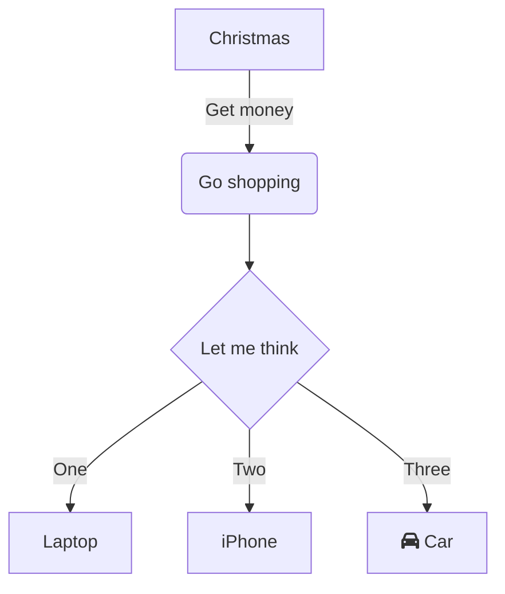

## 対応フォーマット早見表

| **機能** |  | **Markdown編集** | **効果** |
| --- | --- | --- | --- |
| **書式** | **太字** | \*\*text\*\* + Space<br />\_\_text\_\_ + Space | **太字** |
|  | **斜体** | \*text\* + Space<br />\_text\_ + Space | _斜体_ |
|  | **取り消し線** | ~~text~~ + Space | ~~取り消し線~~ |
|  | **下線** | text + Space | 下線 |
|  | **上付き文字** | ^text^ + Space | ^上付き文字^ |
|  | **下付き文字** | ~text~ + Space | ~下付き文字~ |
|  | **テキストハイライト** | \==text== + Space | ==テキストハイライト== |
|  | **インラインコード** | \`text\` + Space | `インラインコード` |
| **見出し** | **見出し1** | # + Space | #  見出し1 |
|  | **見出し2** | ## + Space | ##  見出し2 |
|  | **見出し3** | ### + Space | ###  見出し3 |
|  | **見出し4** | #### + Space | #### 見出し4 |
|  | **見出し5** | ##### + Space | #####  見出し5 |
|  | **見出し6** | ###### + Space | ######  見出し6 |
| **コードブロック** |  | \`\`\` + Enter<br />\`\`\`js + Enter | ```text/x-sh<br />var a = 1;<br />``` |
| **数式** | **インライン数式** | $text$ + Space | abc$a+b$ |
|  | **ブロック数式** | $$text$$ + Space | abc<br />$a+b$ |
| **リスト** | **番号付きリスト** | 1. + Space<br />a. + Space | 1.   リスト<br />    <br />1.  リスト |
|  | **箇条書き** | \* + Space<br />\- + Space | *   リスト<br />    <br />*   リスト |
|  | **タスクリスト** | \[\] + Space<br />\[x\] + Space | *   [ ] タスクリスト<br />    <br />*   [x] タスクリスト |
| **参照** |  | \> + Space | > 参照 |
| **リンク** |  | \[\]() + Space<br />\[abc\]() + Space<br />\[abc\](http://foo) + Space | Webリンクを追加<br />abc<br />[abc](https://foo) |
| **画像** |  | !\[\]() + Space<br />!\[\](http://foo/bar) + Space | DingTalkドキュメントで「画像」をアップロードしてください |
| **ハイライトブロック** | **デフォルトハイライトブロック** | ::: + Enter | :::<br />デフォルト効果<br />::: |
|  | **危険ハイライトブロック** | ::: danger + Enter |  |
|  | **警告ハイライトブロック** | ::: warning + Enter |  |
|  | **情報ハイライトブロック** | ::: info + Enter |  |
|  | **成功ハイライトブロック** | ::: success + Enter |  |
|  | **お知らせハイライトブロック** | ::: tips + Enter |  |
| **Emoji** | | :smile: + Space | |
| **スプレッドシート** |  | \|a\|b\| + Enter |  |
| **区切り線** |  | \*\*\* + Enter<br />\--- + Enter | --- |
| **テキスト作図** |  | \`\`\`mermaid + Enter | ```mermaid<br />graph TD<br />      A[Christmas] -->\|Get money\| B(Go shopping)<br />      B --> C\{Let me think\}<br />      C -->\|One\| D[Laptop]<br />      C -->\|Two\| E[iPhone]<br />      C -->\|Three\| F[fa:fa-car Car]<br />``` |

## Emoji構文

DingTalkドキュメントでは、Markdown構文によるemoji絵文字の入力に対応しています。

## 使い方

`:<コード>:` + `Space` を入力すると、テキストを対応するemoji絵文字に変換できます。対応するemojiの詳細については、『Emojiコード表』をご参照ください。

## コードが多すぎて覚えられない場合

DingTalkドキュメントでは、入力中に入力しようとしているemojiコードの候補を表示するため、わざわざ覚えなくてもemojiをご利用いただけます。

## ハイライトブロック構文

### 1. デフォルトスタイル

`:::` + `Enter` を入力すると、ハイライトブロックを挿入できます。スタイルはデフォルトのロジックに従い、スラッシュ挿入などの効果と同等です。

### 2. 警告ハイライトブロック

`:::warning` + `Enter` を入力すると、警告ハイライトブロックを挿入できます。注意が必要な内容を示す際にご利用いただけます。

### 3. 危険ハイライトブロック

`:::danger` + `Enter` を入力すると、危険ハイライトブロックを挿入できます。特に注意が必要な内容を示す際にご利用いただけます。

### 4. 情報ハイライトブロック

`:::info` + `Enter` を入力すると、情報ハイライトブロックを挿入できます。情報を示す際にご利用いただけます。

### 5. 成功ハイライトブロック

`:::success` + `Enter` を入力すると、成功ハイライトブロックを挿入できます。

### 6. お知らせハイライトブロック

`:::tips` + `Enter` を入力すると、お知らせハイライトブロックを挿入できます。

## 画像構文

## ルール

フォーマットは `` + `スペース` です。

`` + `スペース` を入力すると、プレースホルダーが生成されます。

ALTは空でも構いません。

TITLEはURLと対で出現する必要があり、単独では出現できません。

URLはhttp/httpsプロトコルである必要があります。

## サンプル

以下の例は使用可能です：

```text/x-markdown

```

以下の例は対応していません：

```text/x-markdown

![ab]]()
)

```

## テキスト作図構文

## フォーマット

[mermaid](https://mermaid-js.github.io/mermaid/#/) によって実現されたテキスト作図機能で、mermaid構文に対応しています。

```plaintext
```mermaid
または
```  mermaid
```

## 効果


