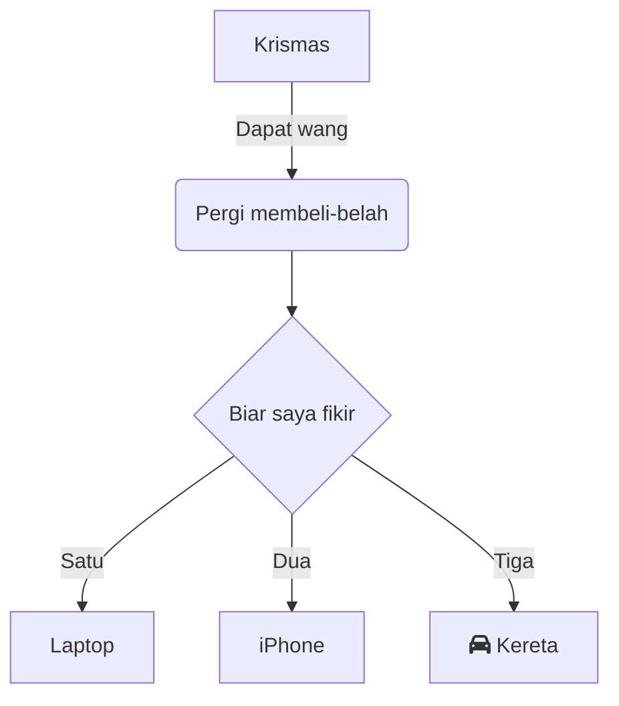

## Ringkasan Format yang Disokong

| **Ciri** |  | **Sintaks Markdown** | **Hasil** |
| --- | --- | --- | --- |
| **Format** | **Tebal** | \*\*text\*\* + Space<br />\_\_text\_\_ + Space | **Tebal** |
|  | **Condong** | \*text\* + Space<br />\_text\_ + Space | _Condong_ |
|  | **Coretan** | ~~text~~ + Space | ~~Coretan~~ |
|  | **Garis Bawah** | text + Space | Garis Bawah |
|  | **Superskrip** | ^text^ + Space | ^Superskrip^ |
|  | **Subskrip** | ~text~ + Space | ~Subskrip~ |
|  | **Sorotan teks** | \==text== + Space | ==Sorotan teks== |
|  | **Kod dalam baris** | \`text\` + Space | `Kod dalam baris` |
| **Tajuk** | **Tajuk 1** | # + Space | #  Tajuk 1 |
|  | **Tajuk 2** | ## + Space | ##  Tajuk 2 |
|  | **Tajuk 3** | ### + Space | ###  Tajuk 3 |
|  | **Tajuk 4** | #### + Space | #### Tajuk 4 |
|  | **Tajuk 5** | ##### + Space | #####  Tajuk 5 |
|  | **Tajuk 6** | ###### + Space | ######  Tajuk 6 |
| **Blok kod** |  | \`\`\` + Enter<br />\`\`\`js + Enter | ```text/x-sh<br />var a = 1;<br />``` |
| **Formula** | **Formula dalam baris** | $text$ + Space | abc$a+b$ |
|  | **Formula blok** | $$text$$ + Space | abc<br />$a+b$ |
| **Senarai** | **Senarai Bernombor** | 1. + Space<br />a. + Space | 1.   Senarai<br />    <br />1.  Senarai |
|  | **Senarai Berbulet** | \* + Space<br />\- + Space | *   Senarai<br />    <br />*   Senarai |
|  | **Senarai tugasan** | \[\] + Space<br />\[x\] + Space | *   [ ] Senarai tugasan<br />    <br />*   [x] Senarai tugasan |
| **Petik** |  | \> + Space | > Petik |
| **Pautan** |  | \[\]() + Space<br />\[abc\]() + Space<br />\[abc\](http://foo) + Space | Tambah pautan web<br />abc<br />[abc](https://foo) |
| **Gambar** |  | !\[\]() + Space<br />!\[\](http://foo/bar) + Space | Pergi ke DingTalk Docs untuk memuat naik "Gambar" |
| **Blok sorotan** | **Blok sorotan lalai** | ::: + Enter | :::<br />Gaya lalai<br />::: |
|  | **Blok sorotan bahaya** | ::: danger + Enter |  |
|  | **Blok sorotan amaran** | ::: warning + Enter |  |
|  | **Blok sorotan info** | ::: info + Enter |  |
|  | **Blok sorotan berjaya** | ::: success + Enter |  |
|  | **Blok sorotan petua** | ::: tips + Enter |  |
| **Emoji** | | :smile: + Space | |
| **Hamparan** |  | \|a\|b\| + Enter |  |
| **Pemisah** |  | \*\*\* + Enter<br />\--- + Enter | --- |
| **Rajah berasaskan teks** |  | \`\`\`mermaid + Enter | ```mermaid<br />graph TD<br />      A[Krismas] -->\|Dapat wang\| B(Pergi membeli-belah)<br />      B --> C\{Biar saya fikir\}<br />      C -->\|Satu\| D[Laptop]<br />      C -->\|Dua\| E[iPhone]<br />      C -->\|Tiga\| F[fa:fa-car Kereta]<br />``` |

## Sintaks Emoji

DingTalk Docs menyokong kemasukan emoji menggunakan sintaks Markdown.

## Penggunaan

Taip `:<code>:` + `Space` untuk menukar teks kepada emoji yang berkaitan. Untuk senarai penuh emoji yang disokong, rujuk "jadual kod emoji".

## Terlalu Banyak Kod untuk Diingati?

DingTalk Docs mencadangkan kemungkinan kod emoji semasa anda menaip, jadi anda boleh menggunakan emoji tanpa perlu menghafalnya.

## Sintaks Blok Sorotan

### 1. Gaya Lalai

Taip `:::` + `Enter` untuk menyisipkan blok sorotan. Gayanya mengikut logik lalai, sama seperti hasil penyisipan melalui menu slash.

### 2. Blok Sorotan Amaran

Taip `:::warning` + `Enter` untuk menyisipkan blok sorotan amaran, digunakan untuk menandakan kandungan yang memerlukan perhatian.

### 3. Blok Sorotan Bahaya

Taip `:::danger` + `Enter` untuk menyisipkan blok sorotan bahaya, digunakan untuk menandakan kandungan yang memerlukan perhatian khas.

### 4. Blok Sorotan Info

Taip `:::info` + `Enter` untuk menyisipkan blok sorotan info, digunakan untuk berkongsi maklumat.

### 5. Blok Sorotan Berjaya

Taip `:::success` + `Enter` untuk menyisipkan blok sorotan berjaya.

### 6. Blok Sorotan Petua

Taip `:::tips` + `Enter` untuk menyisipkan blok sorotan petua.

## Sintaks Gambar

### Peraturan

Gunakan sintaks gambar Markdown standard diikuti dengan Space untuk menjana ruang letak gambar. Peraturan berikut terpakai:

*   Teks ALT boleh dikosongkan.

*   TITLE mesti muncul bersama URL dan tidak boleh muncul sendirian.

*   URL mesti menggunakan protokol http atau https.

## Sintaks Rajah Berasaskan Teks

### Format

Rajah berasaskan teks dikuasakan oleh [mermaid](https://mermaid-js.github.io/mermaid/#/) dan menyokong sintaks mermaid.

```plaintext
```mermaid
or
```  mermaid
```

### Hasil


