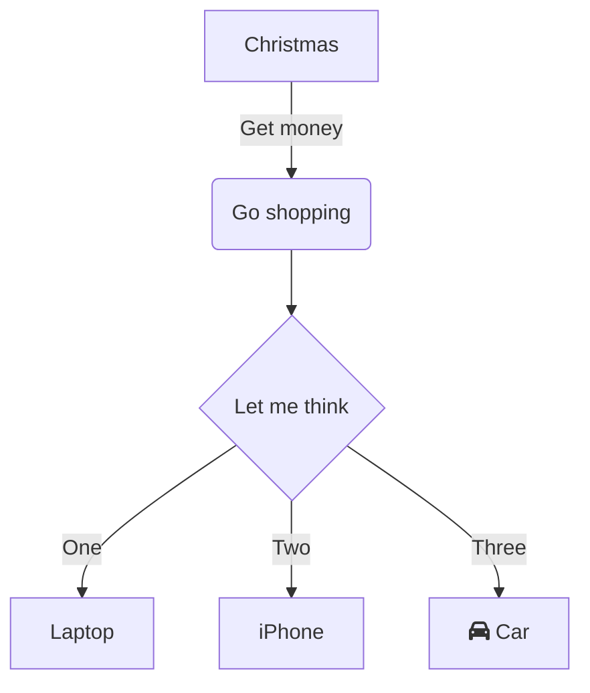

## 支持格式速览

| **功能** |  | **Markdown 编辑** | **效果** |
| --- | --- | --- | --- |
| **格式** | **加粗** | \*\*text\*\* + Space<br />\_\_text\_\_ + Space | **粗体** |
|  | **斜体** | \*text\* + Space<br />\_text\_ + Space | _斜体_ |
|  | **删除线** | ~~text~~ + Space | ~~删除线~~ |
|  | **下划线** | text + Space | 下划线 |
|  | **上标** | ^text^ + Space | ^上标^ |
|  | **下标** | ~text~ + Space | ~下标~ |
|  | **文本高亮** | \==text== + Space | ==文本高亮== |
|  | **行内代码** | \`text\` + Space | `行内代码` |
| **标题** | **标题 1** | # + Space | #  标题1 |
|  | **标题 2** | ## + Space | ##  标题2 |
|  | **标题 3** | ### + Space | ###  标题3 |
|  | **标题 4** | #### + Space | #### 标题4 |
|  | **标题 5** | ##### + Space | #####  标题5 |
|  | **标题 6** | ###### + Space | ######  标题6 |
| **代码块** |  | \`\`\` + Enter<br />\`\`\`js + Enter | ```text/x-sh<br />var a = 1;<br />``` |
| **公式** | **行内公式** | $text$ + Space | abc$a+b$ |
|  | **块级公式** | $$text$$ + Space | abc<br />$a+b$ |
| **列表** | **有序列表** | 1. + Space<br />a. + Space | 1.   列表<br />    <br />1.  列表 |
|  | **无序列表** | \* + Space<br />\- + Space | *   列表<br />    <br />*   列表 |
|  | **任务列表** | \[\] + Space<br />\[x\] + Space | *   [ ] 任务列表<br />    <br />*   [x] 任务列表 |
| **引用** |  | \> + Space | > 引用 |
| **链接** |  | \[\]() + Space<br />\[abc\]() + Space<br />\[abc\](http://foo) + Space | 添加网页链接<br />abc<br />[abc](https://foo) |
| **图片** |  | !\[\]() + Space<br />!\[\](http://foo/bar) + Space | 请至钉钉文档上传「图片」<br /> |
| **高亮块** | **默认高亮块** | ::: + Enter | :::<br />默认效果<br />::: |
|  | **危险高亮块** | ::: danger + Enter |  |
|  | **警示高亮块** | ::: warning + Enter |  |
|  | **信息高亮块** | ::: info + Enter |  |
|  | **成功高亮块** | ::: success + Enter |  |
|  | **提示高亮块** | ::: tips + Enter |  |
| **Emoji** |  | :smile: + Space | 😄 |
| **表格** |  | \|a\|b\| + Enter |  |
| **分割线** |  | \*\*\* + Enter<br />\--- + Enter | --- |
| **文本绘图** |  | \`\`\`mermaid + Enter | ```mermaid<br />graph TD<br />      A[Christmas] -->\|Get money\| B(Go shopping)<br />      B --> C\{Let me think\}<br />      C -->\|One\| D[Laptop]<br />      C -->\|Two\| E[iPhone]<br />      C -->\|Three\| F[fa:fa-car Car]<br />``` |

## Emoji 语法

钉钉文档支持使用 Markdown 语法输入 emoji 表情。

## 使用

输入 `:<编码>:` + `Space` 可以将文本转换为对应的 emoji 表情，具体支持的 emoji 可以查阅《Emoji 编码表》。

## 编码太多记不住？

钉钉文档可以在输入过程中提示你可能想输入的 emoji 编码，无需刻意记忆即可使用 emoji~


## 高亮块语法

### 1. 默认样式

输入 `:::`+ `Enter`可以插入一个高亮块，样式遵循默认的逻辑，与斜杠插入等效果一致：

### 2. 警告高亮块

输入 `:::warning`+ `Enter`可以插入一个警告高亮块，可以用于提示一些需要注意的内容：

### 3. 危险高亮块

输入 `:::danger`+ `Enter`可以插入一个危险高亮块，可以用于提示一些需要特别注意的内容：

### 4. 信息高亮块

输入 `:::info`+ `Enter`可以插入一个信息高亮块，可以用于提示一些信息：

### 5. 成功高亮块

输入 `:::success`+ `Enter`可以插入一个成功高亮块：

### 6. 提示高亮块

输入 `:::tips`+ `Enter`可以插入一个提示高亮块：

## 图片语法

## 规则

格式为：``  + `空格`

当输入 `` + `空格`后，会生成一个占位符

ALT 允许为空

TITLE 必须和 URL 成对出现，不能单独出现

URL 必须为 http/http 协议

## 样例

下面这样是可以的：

```text/x-markdown


```

下面这些是不支持的：

```text/x-markdown

![ab]]()
)


```

## 文本绘图语法

## 格式

文字利用 [mermaid](https://mermaid-js.github.io/mermaid/#/) 实现的文本绘图，支持 mermaid 语法

```plaintext
```mermaid
或
```  mermaid
```

## 效果


